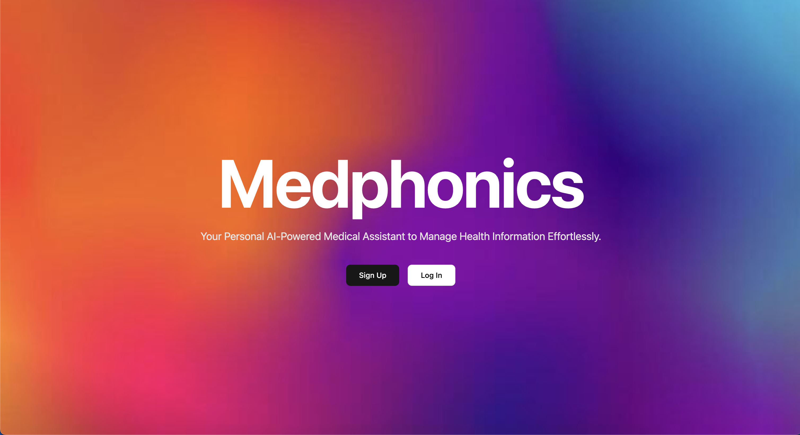
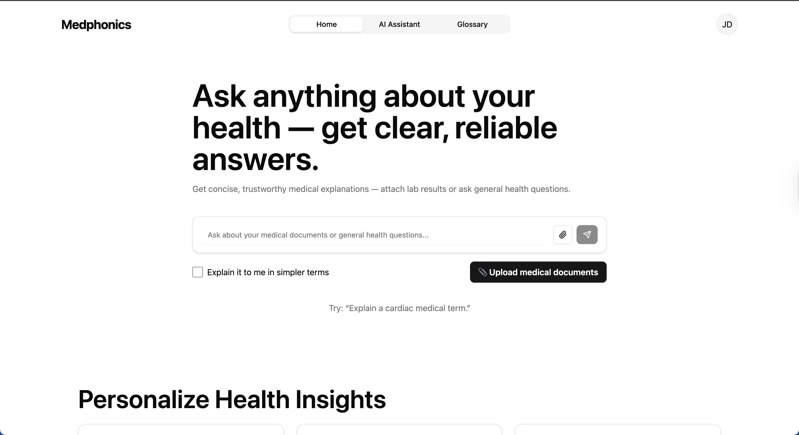
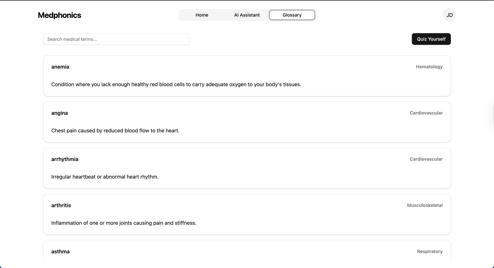

# PARTYOF4: Medphonics

### 🏆 **3rd Place Winner — HackNCAT 9.0 Medtronic 2025**

**Medphonics** is an AI-powered health companion that helps users understand their heart data, learn medical terminology, and ask health-related questions through an intuitive and educational interface.

---

## 🚀 Project Overview

MedPhonics is an **interactive, AI-driven application** dedicated to making cardiovascular health information accessible and understandable for patients.

### 💔 The Problem

Patients managing complex cardiovascular conditions—particularly those with **implantable cardiac devices (ICDs or pacemakers)**—frequently feel overwhelmed and disconnected from their own care. They struggle to interpret **complex medical reports, unfamiliar terminology, and device alerts**, which often leads to confusion, anxiety, and a gap in self-management. 

### 💡 Our Solution

**MedPhonics** empowers users to **take charge of their health knowledge** by transforming obscure medical jargon into **clear, actionable insights**.

The application is built on three core pillars: **AI-Powered Explanations, Interactive Learning, and Personal Health Integration.**

---

### ✨ Key Features & Benefits

| Feature | Description | Benefit to the User |
| :--- | :--- | :--- |
| **Adaptive AI Assistant** | Provides **real-time, adaptable explanations** for any medical term or report section. | Instantly breaks down complexity into simple, easy-to-understand language. |
| **Personalized Health Glossary** | Automatically **builds a custom dictionary** using terms found in your specific reports and device alerts. | Turns unknown jargon into familiar, mastered vocabulary. |
| **Curated Learning Pathway** | Recommends educational articles and content **tailored to your diagnosis, device, and learning needs.** | Provides a guided, trustworthy path to relevant cardiovascular knowledge. |
| **Medical Document Upload** | Allows users to upload medical documents to the site | Summarizes complex medical reports into digestable AI powered summaries |

By simplifying medical information, MedPhonics ensures patients can **clearly understand their health** and feel **more connected** to their medical care team.

---

### 🌐 Learn More

🖥️ **Pitch Deck:** [https://www.canva.com/medphonics](https://www.canva.com/design/DAG4HtR1LUo/H8z2SookHFCvSAxwuuIW_w/view?utm_content=DAG4HtR1LUo&utm_campaign=designshare&utm_medium=link2&utm_source=uniquelinks&utlId=hb4389dfc94)

---

## 👩‍💻 Team – *THE PARTY OF 4*

| Name               | Role                        |
| ------------------ | --------------------------- |
| Rickey Johnson     | Frontend Development        |
| John Sampson       | Backend & AI Integration    |
| Evan Jones         | Supabase / Database         |
| Anthony Charleston | Product Design & Demo Pitch |

---

## ✨ Key Features

* ❤️ **Today’s Heart Summary** — Track weight, heart rate, and blood pressure in a friendly, simple dashboard.
* 🧠 **Ask-Anything AI Assistant** — Ask questions about cardiac health in plain English and get easy-to-understand explanations.
* 📘 **Glossary + Quiz Mode** — Learn medical terms and test your knowledge interactively.
* 🧩 **Supabase Integration** — Backend-ready architecture for authentication and user data.
* ⚡ **Modern Stack:** React + Vite + TailwindCSS + shadcn/ui + Supabase + Node/Express

---

## 🖼️ Screenshots

|                    Landing Page                    |           Ask-Anything Chat           |                Glossary & Quiz                |
| :---------------------------------------------: | :-----------------------------------: | :-------------------------------------------: |
|  |  |  |

---

## 🧩 Architecture Overview

```
/Medphonics
 ├── client/        # React front-end  
 ├── server/        # Node/Express backend with Python GeminiAPI Integration
 ├── supabase/      # Database / Auth / Storage setup  
 └── README.md
```

---

## 💻 Tech Stack

<p align="center">
  
  
  
  
  
  
  
</p>


## ⚙️ Local Setup

### Prerequisites

* Node.js v16+
* npm or yarn
* Supabase CLI *(optional for local dev)*

### Installation

```bash
# Clone the repo
git clone https://github.com/THEPARTYOF4/medphonics.git
cd Medphonics
```

#### Client Setup

```bash
cd client
npm install
npm run dev
```

#### Server Setup

```bash
cd ../server
npm install
npm run dev
```

#### Environment Variables

Create a `.env` file:

```
NEXT_PUBLIC_API_URL=http://localhost:3000
SUPABASE_URL=https://your-supabase-url
SUPABASE_KEY=your-supabase-key
```

---

## 💬 AI Assistant (Demo Mode)

In demo mode, the AI assistant returns **predefined responses** to medical queries such as *“Explain myocardial infarction.”*
Once connected to an AI API (e.g., OpenAI or Gemini), responses will stream in real-time with full medical reasoning.

**Example Request:**

```json
{
  "prompt": "What are common heart conditions?",
  "metadata": { "type": "medical" }
}
```

**Example Response:**

```json
{
  "reply": "Common heart conditions include hypertension, coronary artery disease, and heart failure."
}
```

---

## 📄 License

```
MIT License  
Copyright (c) 2025 THEPARTYOF4
```

---